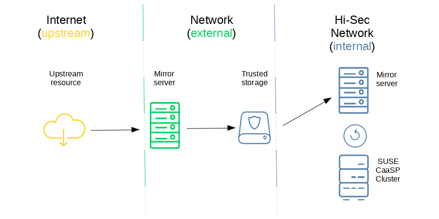

= Air Gapped CaaSP

== Concepts

- upstream: outside customer network
- external: inside customer network, outside airgapped network
- internal: inside airgapped network

Requirement: Strictly NO connection (not even proxy) between internal and external/upstream layers

Scope: Our description will focus on how to mirror CaaSP/SUSE resources

Customer needs to configure additional mirrors for upstream container registries and helm chart repos if they wish to use those

== Machines needed in addition to the cluster

All of these can be hosted on one shared machine for each location

Multiply all these numbers by the amount of fallback/failover you need

External:

- 1 (virtual) machine for every container registry
- 1 (virtual) machine for the RMT server (SLES 15)

Internal:

- 1 (virtual) machine for every container registry
- 1 (virtual) machine for the RMT server (SLES 15)
- 1 (virtual) machine for the helm chart server

You can host multiple container registries on a single machine
you need to run these on different ports

== What needs to be done

=== RPM Package Mirror

. set up an external SMT/RMT mirror to update from the SUSE repository (SLES15)
.. https://www.suse.com/documentation/sles-15/book_rmt/data/book_rmt.html
. set up an internal SMT/RMT mirror that is updated from the external mirror (SLES15)
.. configure all CaaSP nodes to get updates from the internal RMT server
.. internal mirror should be up and running before deploying caasp, this makes
rolling out much easier

=== Container image registry

. set up one external mirror for _each_ container registry to "pull through" images
.. manually select images to retrieve
. set up at least one container registry in the internal network that is updated from the external mirror(s)
.. set the registry to read only in the config file of the internal mirror
.. configure kubernetes to use this internal registry
... Velum -> Settings -> Remote Registries
.. configure CaaSP to rewrite external registry requests to that mirror
... Velum -> Settings -> Mirrors
.. you can host multiple registries on one internal

Add disclaimer that this does not mirror anything from upstream registries other than SUSE
external other registries can be configured in Velum

=== Helm chart repository

. set up an internal helm chart mirror (webserver hosting static files)
.. add helm repo to admin node

Add disclaimer that this does not mirror anything from upstream helm charts other than SUSE

Customer needs to add more mirrors or change helm chart templates to use upstream resources

== Procedure for Update

Container images:

. Update external container registry mirrors from upstream
. Copy registry data onto data storage
. Connect storage to internal instance and upload data

RPM:
https://www.suse.com/documentation/sles-15/book_rmt/data/sec_rmt_mirroring_export_import.html
. Update external package repository from upstream
. Export repo state to data storage
. Connect data storage to internal mirror
. Import repo state

Helm charts:

. Download helm charts from upstream repository
. Transfer charts to internal charts repo webserver
. Run `helm repo update` on admin node

== Procedure for a deployment

RPM:

. transactional update will use the internal resource and install automatically

Container:

. kubernetes will use internal resource
. external resources will fail to load

Helm chart:

. helm will use internal chart repo
. external resources will fail to load

== How to reconfigure existing cluster

. Docker/Kubernetes: Velum -> Settings -> Remote Registries / Mirrors
. RPM: Configure RMT server as repo
. Helm: Configure internal mirror as repo

== Issues

. Not described how to run proper external chart repository mirror
. Not described how to selectively mirror upstream container registries
. Not described how to selectively mirror upstream chart repositories
. Not described how to select containers/packages/charts for mirroring

=== Solved

. SOLVED: Not described how to run SMT/RMT without outside internet connection
. SOLVED: Not described how to keep SMT/RMT internal mirror updated
.. Export/Import RMT repo
. SOLVED: Not described how to configure for other container repos to use external helm charts
.. We don't, customer needs to configure more mirrors or mirror images to internal registry
. SOLVED: Not described how to work with upstream container registries
.. We don't, customer needs to configure more mirrors or mirror images to internal registry
. SOLVED: Not sure if you can mirror multiple container registries on one internal machine
.. You can't
. SOLVED: Not described how to work with upstream charts
.. Will not describe this, customer has to modify chart templates
